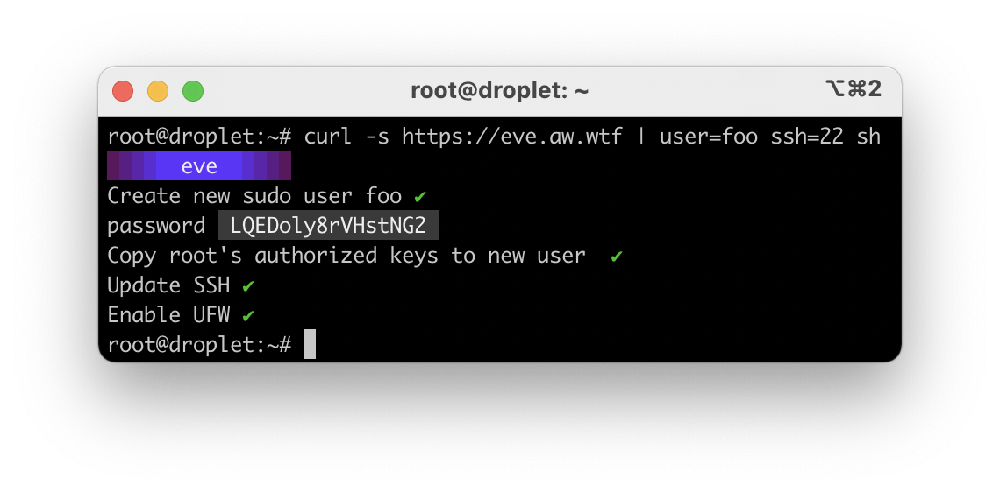

# eva


Automated initial DO droplet setup:
* add new sudo user
* change default ssh port
* prevent root login
* prevent password authentication
* enable ufw with allowed ssh port

## Run

```sh
curl -s https://eve.aw.wtf | user=foo ssh=22 sh
```

* **required** `user` — new user name
* optional `ssh` — new ssh port, 22 by default
